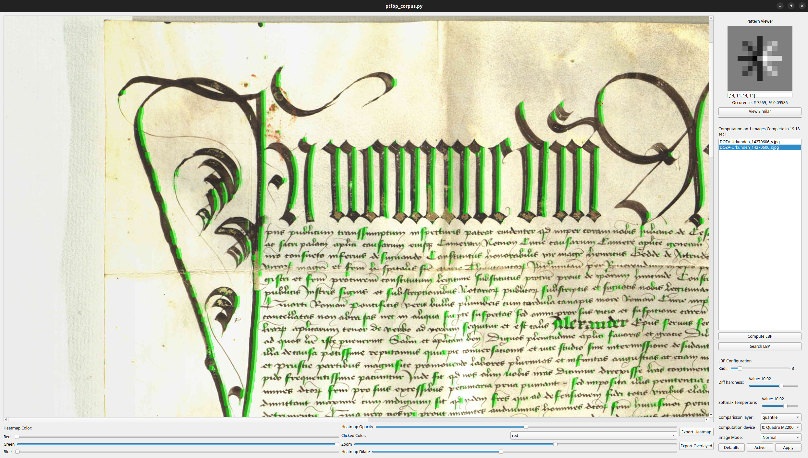

# palexplorator

Non linux version comming!!!!

A tool for interactive data exploration for paleographers.

Software requirements:
- Python 3.11
- pip
- git
- pytorch
- pyqt5
- numpy

Hardware requirements:
- 16GB RAM
- 4 cores
- 5GB free disk space (worst case scenario)
- NVIDIA GPU with 4GB VRAM (optional, but recommended)
